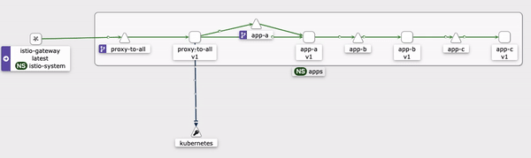
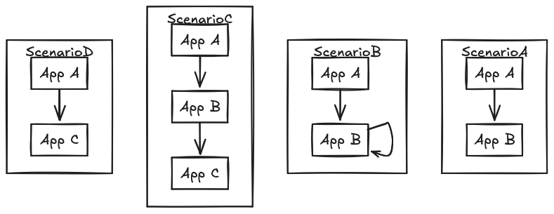

# IstioLab

For deeper insights into Istio and related topics, check out my blog on Medium: [Isar Nasimov's Blog](https://isar-nasimov.medium.com/), where I cover topics like Istio, Kubernetes, and more. Be sure to explore the Istio-related posts for additional tips and best practices!

This project provides a streamlined way to set up a Kubernetes cluster with a single command using [kind](https://kind.sigs.k8s.io/). It automatically configures [Istio](https://istio.io/), [Kiali](https://kiali.io/), [Grafana](https://grafana.com/), [k6](https://k6.io/), and a custom application via [Taskfile](https://taskfile.dev/).

## Prerequisites

Before you start, ensure the following tools are installed:

- [Kind](https://kind.sigs.k8s.io/) (for managing Kubernetes clusters)
- [Docker](https://www.docker.com/) (for container management)
- [Task](https://taskfile.dev/) (for task automation)
- [Helm](https://helm.sh/) (for managing Kubernetes applications)

### Optional (For Modifying the App)

If you plan to modify the custom app, you will also need:

- [Go](https://go.dev/) (for app development)
- [Kustomize](https://kustomize.io/) (for customizing Kubernetes resources)

## Project Structure

- **[app](./app/README.md)**: Contains the Go code and Kubernetes manifests for the microservices.
- **[istio](./istio/README.md)**: Holds all Istio-related configurations and files.
- **[k6](./k6/README.md)**: Includes the k6 `script.js` and Kubernetes manifest to run load tests.
- **kind**: Contains the Kind cluster configuration.
- **[monitoring](./monitoring/README.md)**: Includes Grafana Kubernetes manifests and Grafonnet files to define dashboards.

## How to Use

1. **Create the Cluster**
   - Run `task create` to set up the cluster. 
   - If it's your first time using this lab, remember to update your hosts file as prompted at the end of the task.

2. **Run a Test**
   - Use `task test-{delay}-{count}` to run a test, where `delay` is a Go duration (e.g., `20ms`, `1s`, `1h`), and `count` is the number of requests (integer).
   - Example: `task test-20ms-20-A` or loop the test: `while true; do task test-20ms-20-A && sleep 30; done`

3. **View Logs**
   - Run `task logs-{deployment}` to view logs, where `{deployment}` is the name of the deployment (e.g., `task logs-app-a`).

4. **Delete the Cluster**
   - Run `task delete` to tear down the cluster.

## Architecture

This diagram illustrates the basic architecture, showing deployments connected to an ingress (Istio Gateway).

## Scenarios

Each scenario generates load on the last workload in the traffic chain. For example, in `/scenarioA`, App B performs intense computation for 5 seconds.

### Scenario Descriptions

- **/scenarioA**: 
  App A sends traffic to App B. It's a simple, one-directional flow from A to B.
  
- **/scenarioB**: 
  App A sends traffic to App B, similar to Scenario A. However, App B has a feedback loop and sends some response back to itself (loopback behavior).
  
- **/scenarioC**: 
  App A sends traffic to App B, and App B forwards traffic to App C. This creates a traffic chain from A → B → C.
  
- **/scenarioD**: 
  App A directly sends traffic to App C, bypassing App B entirely. This scenario simplifies the flow by skipping the middle step.

## Contributing

We welcome contributions! If you'd like to improve the project or add new features:

1. Fork the repository.
2. Create a new branch for your feature: `git checkout -b feature-name`.
3. Make your changes and test them.
4. Submit a pull request, describing the changes and the rationale behind them.

Feel free to open issues or feature requests as well!

---

Thank you for contributing and helping to improve IstioLab!
